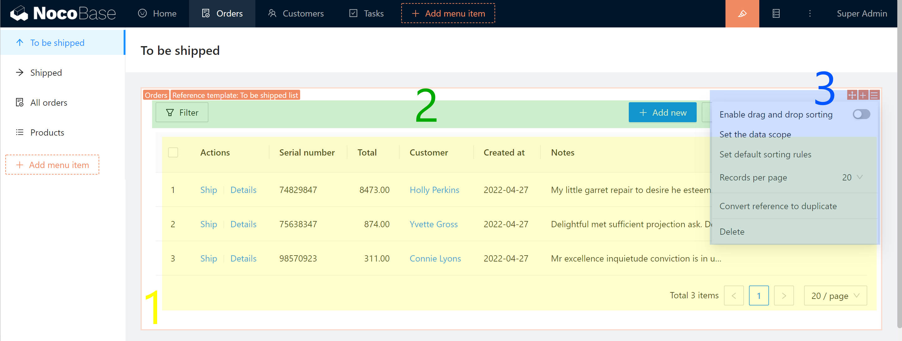
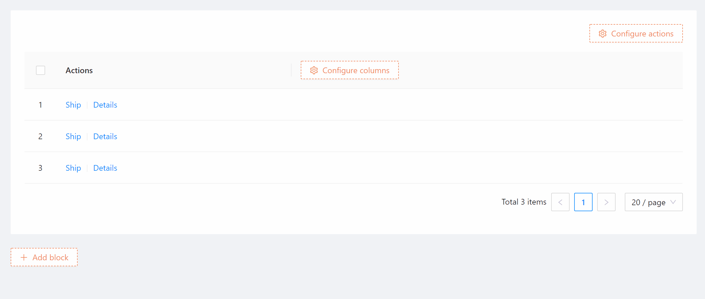

# Blocks

Blocks are views that are used to display and manipulate data. Blocks can be placed in pages and popups. A block consists of three parts.

1. content area: the body of the block
2. action area: various action buttons can be placed to manipulate the block data
3. configuration area: buttons for operating the block configuration

## Add block

Enter the UI Editor mode and click the Add block button on the page and in the pop-up window to add the block. The options are divided into 4 steps.

1. Select block type: Currently available block types include Table, Form, Details, Calendar, Kanban, Markdown
2. Select Collection: All collections will be listed here
3. Choose the creation method: create a blank block, or duplicate a block template , or reference a block template
4. Select Template: If you selected Create from Template in step 3, select the template in step 4

## Configure Blocks

The configuration of blocks consists of three elements.

- Configure block content
- Configure block actions
- Configure block properties

### Configure block content

Take the table block as an example, the content of the block is the columns to be displayed in the table. Click Configure columns to configure the columns to be displayed.

### Configure block actions

Take table block as an example, there are filter, add, delete, view, edit, customize and other actions available. Click the Configure actions button to configure the actions. Each of the action buttons can be configured for their own properties.

### Configure block properties

Move the cursor to the upper right corner of the block and you will see the block configuration button. Using the table block as an example, the following properties can be configured.

- Drag & drop sorting
- Set the data scope
- Set default sorting rules
- Records per page

## Block Types

Currently NocoBase supports the following types of blocks.

- Table
- Form
- Details
- Kanban
- Calendar
- Related Data
- Markdown