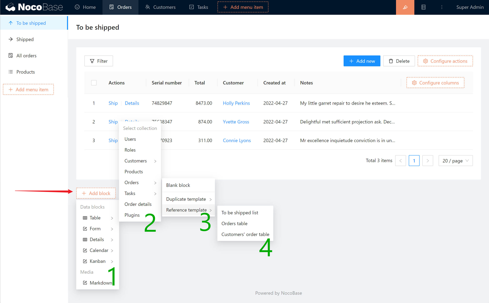
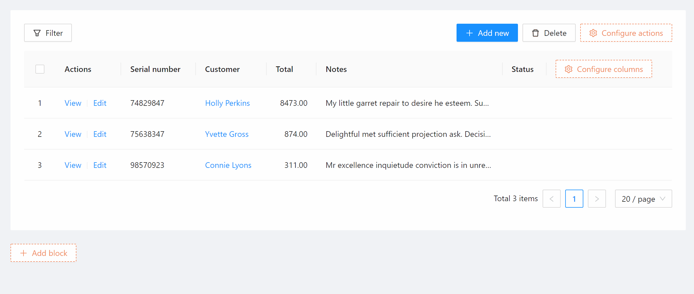

# 区块

区块是用来展示和操作数据的视图。区块可以放在页面和弹窗里。一个完整的区块由三部分组成：

1. 内容区：区块的主体
2. 操作区：可以放置各种操作按钮，用于操作区块数据
3. 配置区：操作区块配置的按钮

## 添加区块

进入界面配置模式，在页面和弹窗内点击 Add block 按钮即可添加区块。选项分为 4 步：

1. 选择区块类型：目前可用的区块类型包括表格、表单、详情、日历、看板、Markdown
2. 选择 Collection：此处会列出所有的 Collection
3. 选择创建方式：创建空白区块，或者从复制区块模板，或者引用区块模板
4. 选择模板：若第 3 步选择了从模板创建，则在第 4 步选择模板

## 配置区块

配置区块包括三方面的内容：

- 配置区块内容
- 配置区块操作
- 配置区块属性

### 配置区块内容

以表格区块为例，区块内容是指表格中要显示的列。点击 Configure columns 即可配置要显示的列：

### 配置区块操作

以表格区块为例，有筛选、添加、删除、查看、编辑、自定义等操作可选。点击 Configure actions 按钮可以配置操作。其中，每个操作按钮都可以单独配置属性：

### 配置区块属性

将光标移到区块右上角，会看到区块配置按钮。以表格区块为例，可以配置的属性有：

- Drag & drop sorting
- Set the data scope
- Set default sorting rules
- Records per page

## 区块类型

目前 NocoBase 支持以下几种区块：

- 表格
- 表单
- 详情
- 看板
- 日历
- 相关数据
- Markdown